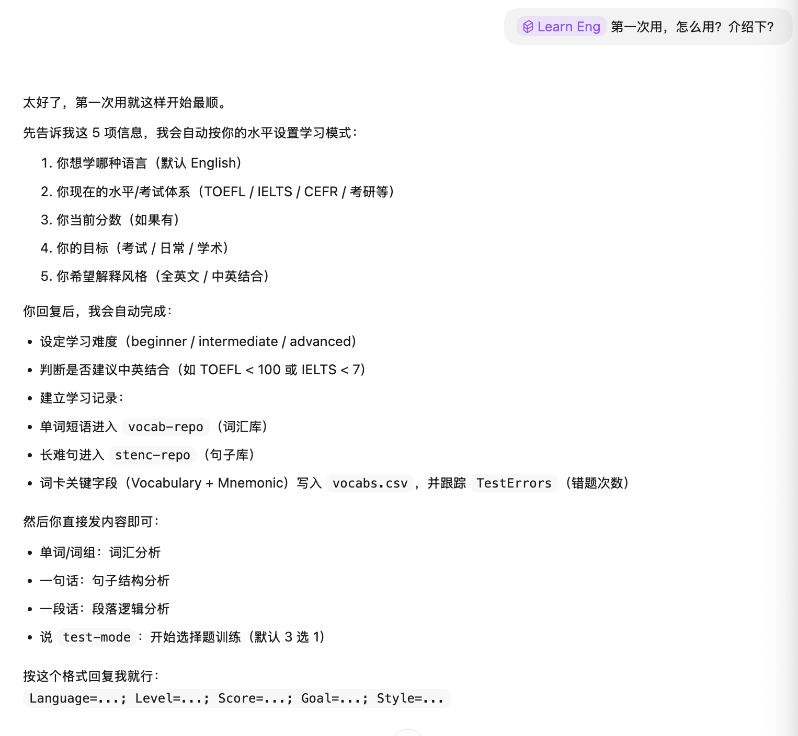
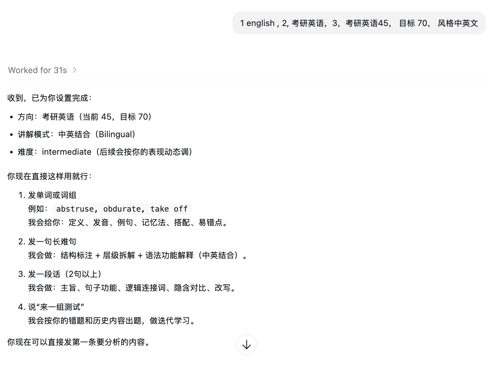
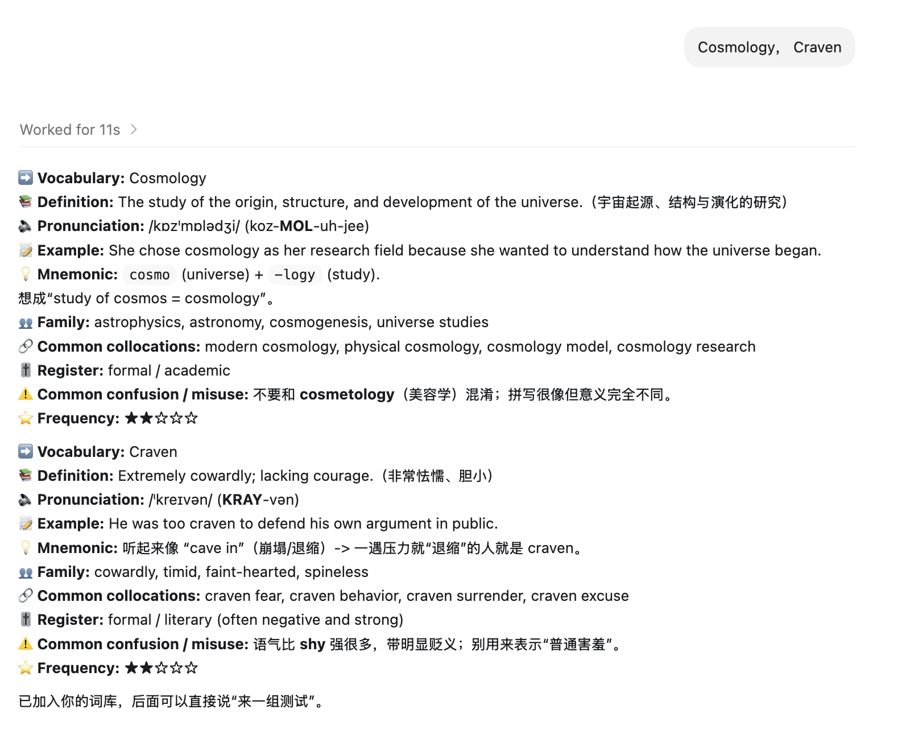
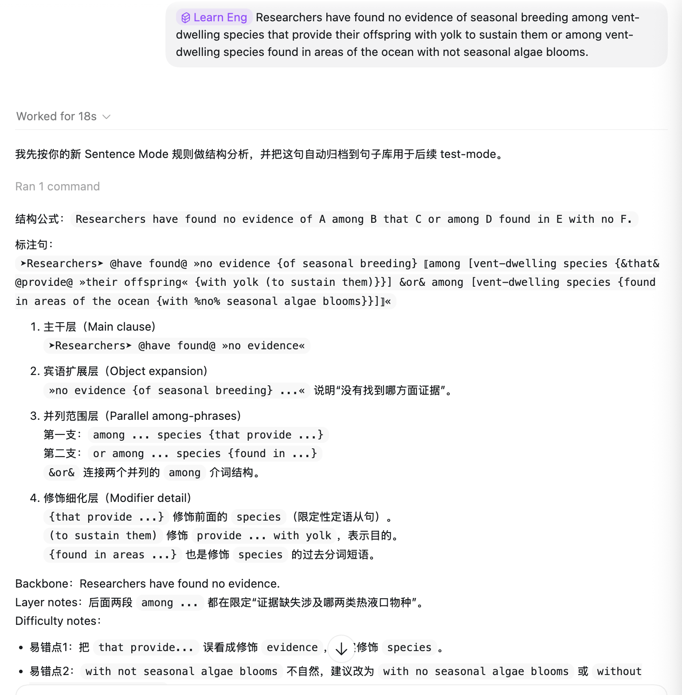
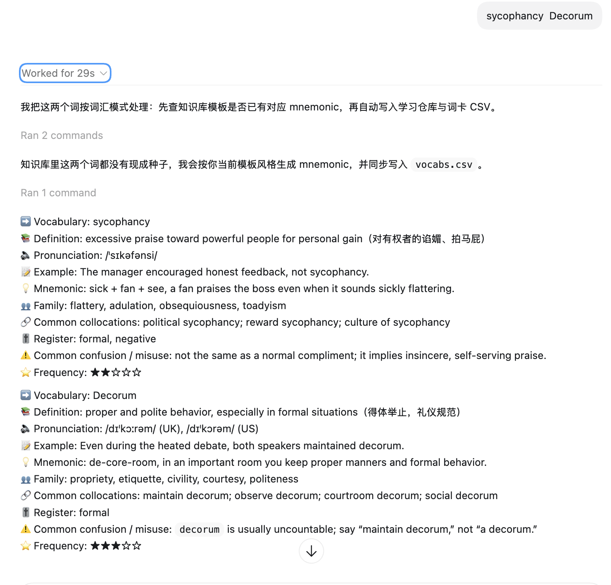
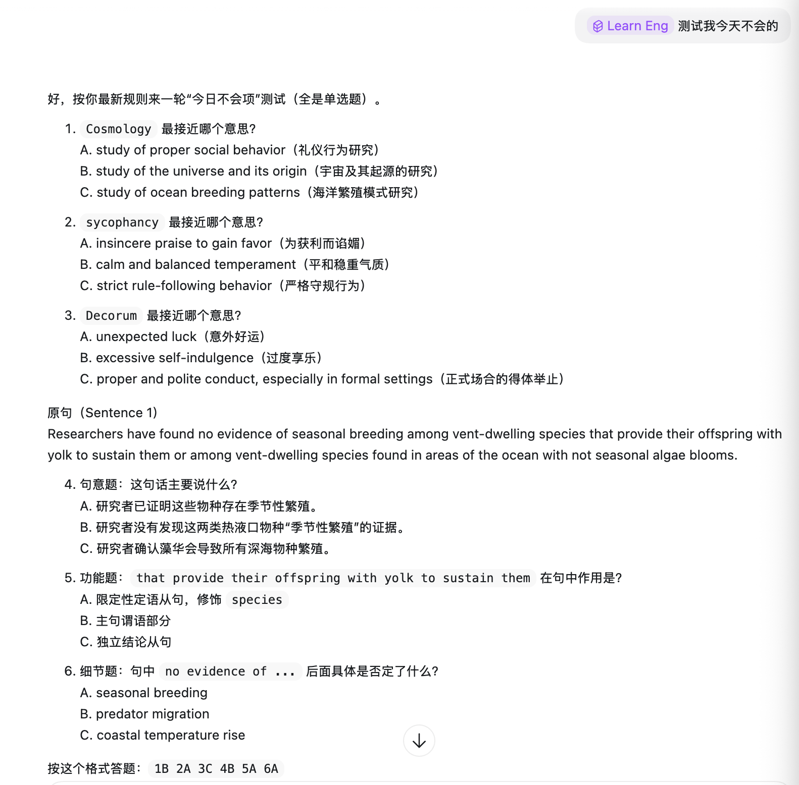
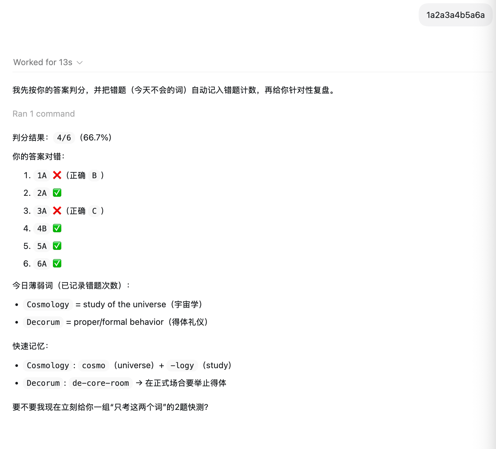
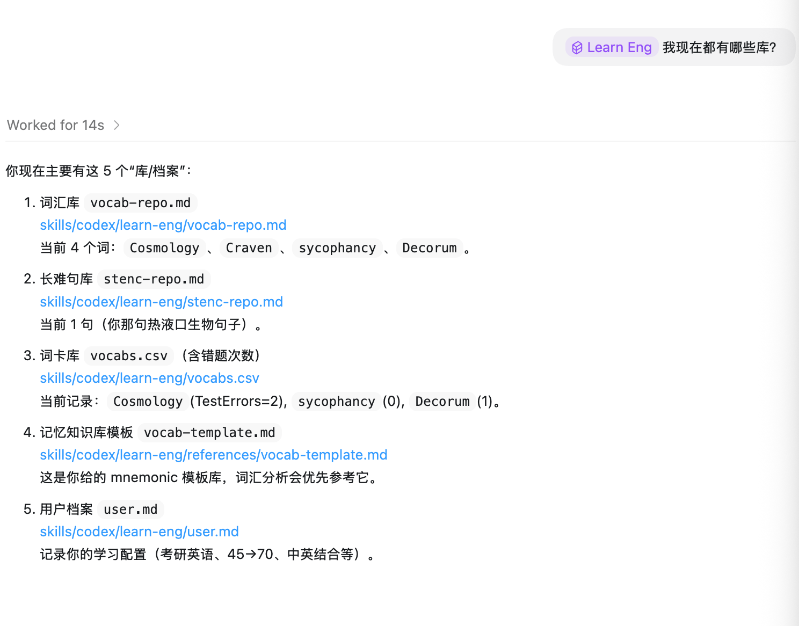

# learn-eng-skill

> [!TIP]
> 原对应 Prompt 仓库创建于 **2023-06-18**，已获得 **85+ stars**。
> 如果你对原始 Prompt 体系感兴趣，可前往：
> [EmbraceAGI/Mr.G-Your-AI-English-all-language-Tutor](https://github.com/EmbraceAGI/Mr.G-Your-AI-English-all-language-Tutor)

## 项目介绍图（按顺序）










一个面向中文学习者的英语学习 Skill 项目，支持 Codex、Claude Code、OpenClaw 与其他通用 Agent：
- 难词分析
- 长难句拆解
- 段落逻辑理解
- 错题驱动的迭代测试

项目目标：把“背单词 + 读句子 + 做测试 + 复盘”串成一条稳定、可积累的学习链路。

## 推荐使用方式
- 推荐优先使用 `Claude Code` / `Codex` 这类具备本地文件读写能力的 Agent。
- 原因：`user.md`、`vocab-repo.md`、`stenc-repo.md`、`vocabs.csv` 可自动更新，学习链路更稳定，迭代效果通常更好。

## 核心能力
- 自动路由三类输入：词汇 / 句子 / 段落
- 词汇卡片化输出（定义、发音、例句、助记、搭配、误用提醒等）
- 句子结构标注（主谓宾、修饰层级、连接词、引导语等）
- 段落逻辑拆解（主张、论证角色、连接信号、隐含前提）
- Test Mode 选择题训练（错题优先）
- 单词艾宾浩斯调度（到期词优先）
- 学习数据自动沉淀到本地仓库（可持续迭代）

## 目录结构（通用化）
```text
skills/
├── learn-eng/                  # 通用核心（唯一真源）
│   ├── SKILL.md
│   ├── user.md
│   ├── vocab-repo.md
│   ├── stenc-repo.md
│   ├── vocabs.csv
│   ├── references/
│   ├── scripts/
│   └── agents/
├── codex/learn-eng -> ../learn-eng
├── claude/learn-eng -> ../learn-eng
└── openclaw/learn-eng -> ../learn-eng
```

说明：
- `skills/learn-eng` 是核心目录。
- `codex/claude/openclaw` 入口目前共享核心，后续如需平台差异化可各自拆分。

## 使用前准备（Codex / Claude Code / 通用 Agent）
1. 获取 Codex（官方入口）
- 产品页：[OpenAI Codex](https://openai.com/codex)
- 快速开始：[Get started with Codex](https://openai.com/codex/get-started/)

2. 克隆仓库
```bash
git clone git@github.com:gy-hou/learn-eng-skill.git
cd learn-eng-skill
```

3. 入口路径
- 通用核心：`skills/learn-eng/SKILL.md`
- Codex 兼容入口：`skills/codex/learn-eng/SKILL.md`
- Claude 兼容入口：`skills/claude/learn-eng/SKILL.md`
- OpenClaw 兼容入口：`skills/openclaw/learn-eng/SKILL.md`
- OpenClaw 入口配置：`OPENCLAW.md`

4. OpenClaw 最小配置（可选）
在 `~/.openclaw/openclaw.json` 中启用并显式允许 `learn-eng`：
```json
{
  "skills": {
    "entries": {
      "learn-eng": { "enabled": true }
    }
  },
  "agents": {
    "defaults": {
      "skills": ["learn-eng"]
    }
  }
}
```

## 首次使用（5 项配置）
首次会采集以下配置（可缺省）：
1. 学习语言
2. 当前水平 / 考试体系（CEFR / IELTS / TOEFL / 考研）
3. 当前分数
4. 目标
5. 解释风格（全英文 / 中英结合）

示例：
```text
Language=English; Level=考研英语; Score=45; Goal=70; Style=中英结合
```

## 极简链路
1. 发一个词：词汇分析并写入词库
2. 发一句话：句子结构分析并写入句库
3. 输入 `test-mode`：自动抽取到期词/易错题做选择题
4. 批改后调用 `mark-correct` / `mark-missed`：更新记忆阶段

## 学习数据文件（本地）
- `skills/learn-eng/user.md`：用户档案
- `skills/learn-eng/vocab-repo.md`：难词库
- `skills/learn-eng/stenc-repo.md`：长难句库
- `skills/learn-eng/vocabs.csv`：词卡 + 错题 + 复习阶段（Stage/NextReviewAt/...）
- `skills/learn-eng/references/vocab-template.md`：助记知识库模板

## 本地脚本（可选）
在 `skills/learn-eng/` 目录下：
```bash
python3 scripts/learn_eng_repo.py init
python3 scripts/learn_eng_repo.py ingest --input "Cosmology, Craven"
python3 scripts/learn_eng_repo.py test-mode --vocab-count 5 --sentence-count 2
python3 scripts/learn_eng_repo.py mark-correct --word Cosmology
python3 scripts/learn_eng_repo.py mark-missed --word Craven
```

## 许可证
MIT License，见 [LICENSE](LICENSE)。
